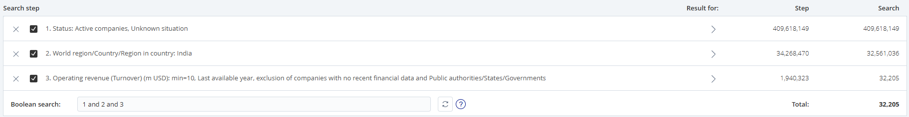
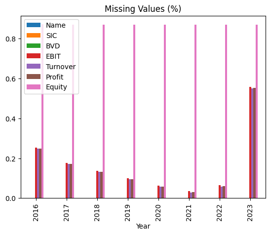
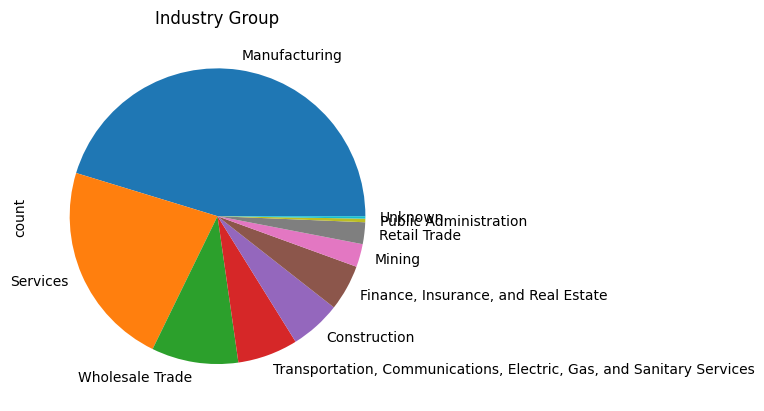
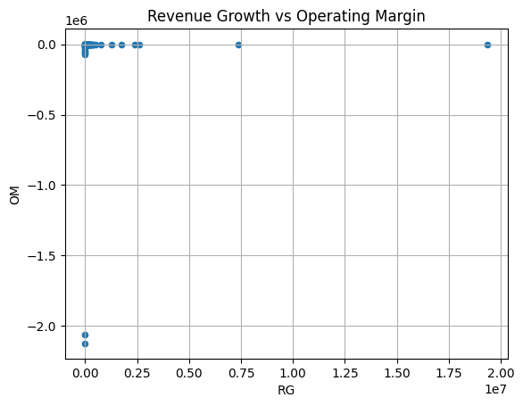

  # Resilient Cos

In this document, we explain the analysis conducted for the *Resilient Companies* project. The goal of this project is to classify companies into one of three categories, based on how they perform compared to their industry average according to different metrics.

## Introduction
From the [Orbis portal](https://login.bvdinfo.com/R0/Orbis) we download raw data about indian companies using the following filtering:

  

The data comes in form of a table split into two `.xlsx` files for capacity constraints. We have information about `29,390` companies uniquely identified by their `BvD ID number`.  
We manipulate the tables to obtain a single dataset with the following features:

- Company Name
- US SIC
- BvD ID Number
- Year
- Operating Profit (EBIT)
- Operating Revenue (TURNOVER)
- Profit (Net Income)
- Total Equity  

For each unique company, we have financial information regarding the years from `2016` to `2023`.  

**Note**: There are companies with the same name operating in different sectors, which are to be considered different for the purpose of this analysis. From now on, we use the `BvD ID Number` (`BVD`) to assess the uniqueness of each company.

## Pre-processing
Before conducting the analysis, we process the dataset by dealing with null values, then we compute the required metrics and manage outliers.

### Missing Values 
We discard entirely the `Total Equity` feature, due to the high number of missing values.

We drop the entry for a company in a given year if at least one of the required indicators is missing.

Morevoer, we drop all those companies with `TURNOVER = 0`, to avoid the metrics to diverge when we compute them later.

We are left with `8,124` unique companies, with complete data for all observed years.

### Features Extraction
For each tuple (`BVD`, `Year`) we compute the relevant metrics:
  - Growth Rate at year t: `GR_t = (TURNOVER_{t+1} - TURNOVER_{t}) / TURNOVER_{t}`
  - Operating Margin at year t: `OM_t = EBIT_{t} / TURNOVER_{t}`

By construction, `GR` is not available for the first year: we drop year `2017` for all companies.  

Then, we use a simple lookup table to retrieve the industry from the first 2 digits of the `US SIC` code.

### Outliers
By simple visual inpection, no significant outliers can be identified on the scatterplot of `RG` vs `OM`. We keep all the data in this stage.

## Resilient Analysis
We now compare each company's performance with the corresponding industry average for each observed year (from `2017` to `2023`).  

We say that a company is a *break-away company* in a period if both `OM` and `RG` are above the industry median for all years included in the period. 

For example, company A is break-away before 2020 if its `OM` is above the industry median and its `RG` is above the industry median of each year `2017`, `2018`, `2019`, taken singularly.

In particular, we identify the following disjoint subsets:
- **Resilient** Companies -> break-away companies *before* and *after* year 2020 exclusive -> 84 cos
- **Non-Resilient** Companies -> break-away companies *before* but *not after* year 2020 exclusive -> 428 cos
- **New Break-away** Companies -> break-away companies *after* but *not before* year 2020 exclusive -> 392 cos

**Note**: we consider the median as aggregate function because it is more robust to outliers and extreme values.

## Appendix
The following data is made available at [this link](https://github.com/giacomo-ciro/240713_resilient-companies/tree/main/data):
- `orbis_raw_1_15000.xlsx` the first part of the raw data as directly downloaded from Orbis
- `orbis_raw_15001_32205.xlsx` the second part of the raw data as directly downloaded from Orbis
- `orbis.csv` the data obtained by concatenating, melting and pivoting the raw data 
- `orbis_final.csv` the data after preprocessing, feature extraction and outlier handling
- `breakaway_before_2020.csv` the list of break-away companies before year 2020 exclusive, ordered alphabetically
- `breakaway_after_2020.csv` the list of break-away companies after year 2020 exclusive, ordered alphabetically
- `breakaway_before_2020_all_years.csv` the list of break-away companies before year 2020 exclusive, with metrics and industry median for year 2017-2018-2019
- `breakaway_after_2020_all_years.csv` the list of break-away companies after year 2020 exclusive, with metrics and industry median for year 2021-2022-2023
- `resilient.csv` list of resilient companies as identified by this analysis
- `non_resilient.csv` list of non-resilient companies as identified by this analysis
- `new_breakaway_metrics.csv` list of new-breakaway companies as identified by this analysis
- `resilient_all_metrics.csv` list of resilient companies as identified by this analysis, with OM and RG for all years
- `non_resilient_all_metrics.csv` list of non-resilient companies as identified by this analysis, with OM and RG for all years
- `new_breakaway_all_metrics.csv` list of new-breakaway companies as identified by this analysis, with OM and RG for all years
- `resilient_by_OM.cvs` list of resilient companies as identified by this analysis, ordered by average OM across all years in descending order
- `non_resilient_by_OM.cvs` list of non-resilient companies as identified by this analysis, ordered by average OM across years before 2020 exclusive, in descending order
- `new_breakaway_by_OM.cvs` list of new-breakaway companies as identified by this analysis, ordered by average OM across years after 2020 exclusive, in descending order
- `resilient_by_RG.cvs` list of resilient companies as identified by this analysis, ordered by average RG across all years in descending order
- `non_resilient_by_RG.cvs` list of non-resilient companies as identified by this analysis, ordered by average RG across years before 2020 exclusive, in descending order
- `new_breakaway_by_RG.cvs` list of new-breakaway companies as identified by this analysis, ordered by average RG across years after 2020 exclusive, in descending order
- `industry_median_before_2020.cvs` industry medians computed and used in this analysis, before year 2020 exclusive
- `industry_median_after_2020.cvs` industry medians computed and used in this analysis, after year 2020 exclusive
