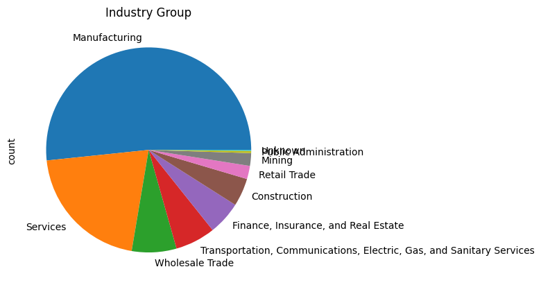
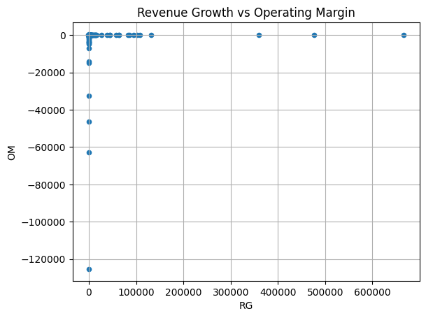
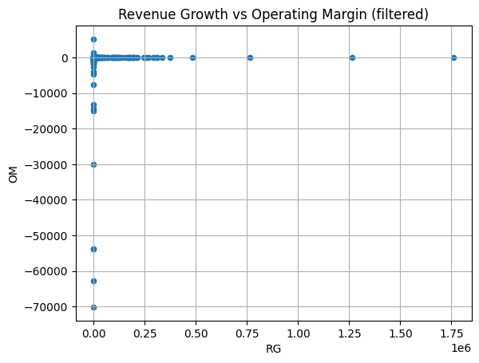

  # Resilient Cos

In this document, we explain the analysis conducted for the *Resilient Companies* project. The goal of this project is to classify companies into one of three categories, based on how they perform compared to their industry average according to different metrics.

## Introduction
From the [Orbis portal](https://login.bvdinfo.com/R0/Orbis) we download raw data about indian companies. The data comes in form of a table split into two `.xlsx` files for capacity constraints. We have information about `31,710` companies uniquely identified by their `BvD ID number`.  
We manipulate the tables to obtain a single dataset with the following features:

- Company Name
- US SIC
- BvD ID Number
- Year
- Operating Profit (EBIT)
- Operating Revenue (TURNOVER)
- Profit (Net Income)
- Total Equity  

For each unique company, we have financial information regarding the years from 2017 to 2023.  

**Note**: There are companies with the same name operating in different sectors, which are to be considered different for the purpose of this analysis. From now on, we use the BvD ID Number (BVD) to assess the uniqueness of each company.

## Pre-processing
Before conducting the analysis, we process the dataset by dealing with null values, then we compute the required metrics and manage outliers.

### Missing Values 
First, we drop entirely the year `2023` due to the high number of missing values encountered (>90%). For the other years, the number of missing values is <20% for all features, except for the `Total Equity`. Therefore, we discard entirely this feature and keep the non-null values for the others.  

Morevoer, we drop all those companies with `TURNOVER==0`, to avoid the metrics to diverge when we compute them later.

### Features Extraction
For each tuple (BVD, Year) we compute the relevant metrics:
  - Growth Rate at year t: `GR_t = (TURNOVER_{t+1} - TURNOVER_{t}) / TURNOVER_{t}`
  - Operating Margin at year t: `OM_t = EBIT_{t} / TURNOVER_{t}`

By construction, `GR` is not available for the first year: we drop year `2017` for all companies.  

Then, we use a simple lookup table to retrieve the industry from the first 2 digits of the `US SIC` code.

### Outliers
We approach the outlier problem via simple visual inpection of the scatterplot of `RG` vs `OM`. We restrict the valid companies to those with `RG < 5e6` and `OM > -1e6`.

## Resilient Analysis
After preprocessing, we are left with `20,636` unique companies identified by their BVD and the respective `OM` and `RG` are measured for the years from `2018` to `2022` inclusive. We now compare each company's performance with the corresponding industry average.  

We say that a company is a *break-away company* in a period if both `OM` and `RG` are above the industry median for the entire period. 

In particular, we identify the following disjoint subsets:
- **Resilient** Companies -> break-away companies *before* and *after* year 2020 exclusive -> 479 cos
- **Non-Resilient** Companies -> break-away companies *before* but *not after* year 2020 exclusive ->1704 cos
- **New Break-away** Companies -> break-away companies *after* but *not before* year 2020 exclusive ->1717 cos

**Note**: we consider the median as aggregate function because it is more robust to outliers and extreme values.

## Appendix
The following data is made available at [this link](https://github.com/giacomo-ciro/240713_resilient-companies/tree/main/data):
- `orbis_raw_1_15000.xlsx` the first part of the raw data as directly downloaded from Orbis
- `orbis_raw_15001_31710.xlsx` the second part of the raw data as directly downloaded from Orbis
- `orbis.csv` the data obtained by concatenating, melting and pivoting the raw data 
- `orbis_final.csv` the data after preprocessing, feature extraction and outlier handling
- `breakaway_before_2020.csv` the list of break-away companies before year 2020 exclusive, ordered alphabetically
- `breakaway_after_2020.csv` the list of break-away companies after year 2020 exclusive, ordered alphabetically
- `breakaway_before_2020_all_years.csv` the list of break-away companies before before 2020 exclusive, with metrics and industry median for year 2018-2019
- `breakaway_after_2020_all_years.csv` the list of break-away companies after year 2020 exclusive, with metrics and industry median for year 2021-2022
- `resilient.csv` list of resilient companies as identified by this analysis
- `non_resilient.csv` list of non-resilient companies as identified by this analysis
- `new_breakaway.csv` list of new-breakaway companies as identified by this analysis
 
